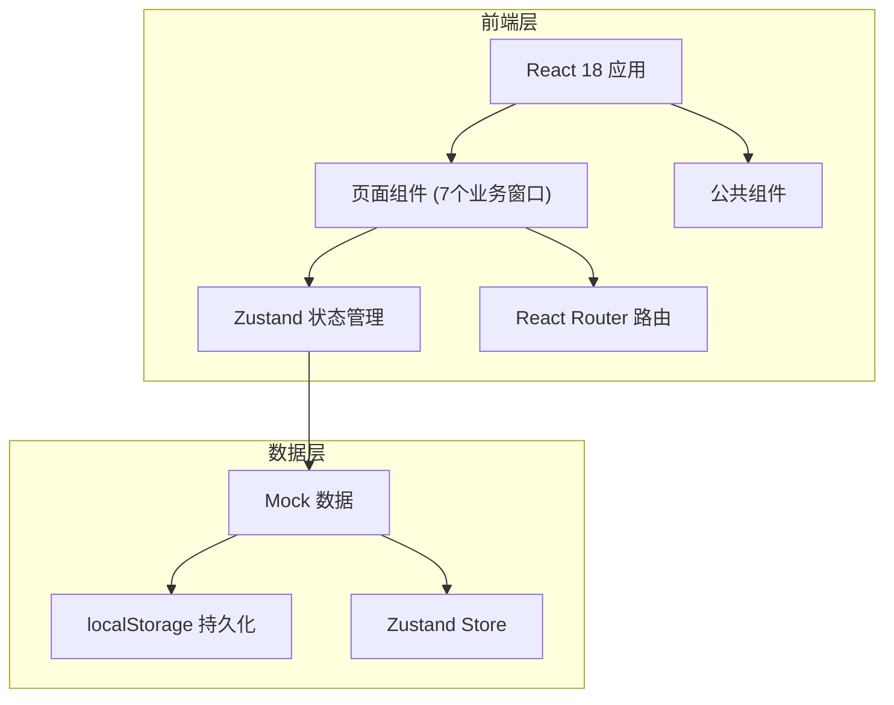
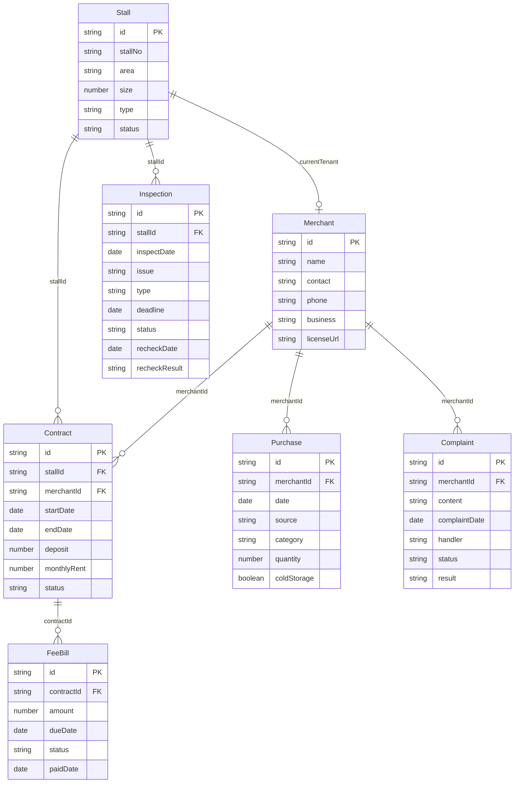

## 1. 架构设计

## 2. 技术说明
- 前端：React@18 + TypeScript + TailwindCSS@3 + Vite
- 初始化工具：vite-init
- 后端：无（纯前端，使用Mock数据 + localStorage持久化）
- 数据库：无（使用localStorage模拟数据持久化）
- 状态管理：Zustand
- 路由：React Router DOM v6
- 图表：Recharts
- 图标：Lucide React
- 日期处理：date-fns
- 导出：xlsx（SheetJS）用于导出Excel

## 3. 路由定义
| 路由 | 用途 |
|------|------|
| / | 重定向到 /stalls |
| /stalls | 摊位台账页面 |
| /contracts | 合同费用页面 |
| /merchants | 商户档案页面 |
| /purchases | 进货登记页面 |
| /complaints | 投诉处理页面 |
| /inspections | 巡查整改页面 |
| /dashboard | 看板报表页面 |

## 4. API定义
本项目为纯前端应用，使用Mock数据和localStorage持久化，不涉及后端API。

## 5. 服务器架构图
不适用（纯前端应用）

## 6. 数据模型

### 6.1 数据模型定义

### 6.2 数据定义语言
使用TypeScript接口定义数据模型，存储于localStorage中：

- `stalls`: Stall[] - 摊位数据
- `merchants`: Merchant[] - 商户数据
- `contracts`: Contract[] - 合同数据
- `feeBills`: FeeBill[] - 收费单数据
- `purchases`: Purchase[] - 进货记录数据
- `complaints`: Complaint[] - 投诉数据
- `inspections`: Inspection[] - 巡查整改数据
